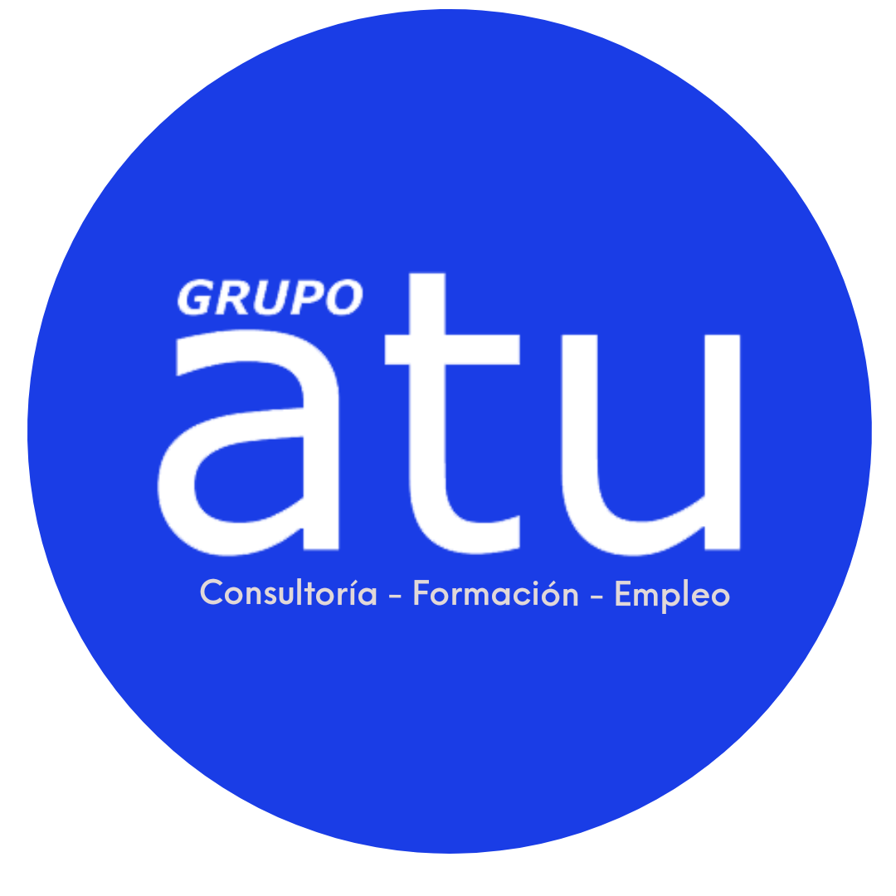
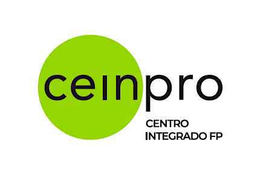
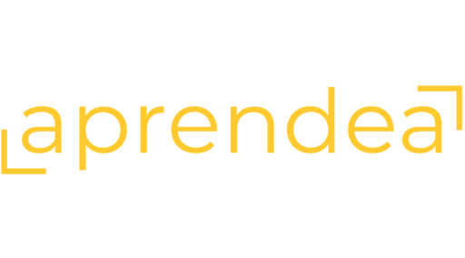

# **Certificados** 
---
{ width="150", align=left}
## [`MLOps con Microsoft Azure ML y Github Actions`:octicons-link-external-24:](files/Diploma_ml_ops.pdf)
---
{ width="130", align=left}
## [`Modelos y sistemas de Inteligencia Artificial basados en aprendizaje automático`:octicons-link-external-24:]()
---
{ width="150", align=left}
## [`Machine Learning Aplicado Usando Python`:octicons-link-external-24:](files/Diploma_CEINPRO_ML.pdf)
---
{ width="150", align=left}
## [`Experto en Data & Analytics`:octicons-link-external-24:](files/Diploma_data_analytics.pdf)
---

